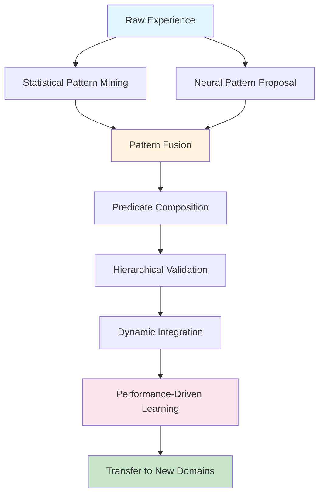

# Novelty Analysis: Hierarchical Predicate Discovery vs. Existing Methods

## Comparison with Neural Logic Machines (NLMs)

### **Neural Logic Machines (Dong et al., 2019)**

**What NLMs Do:**
- Use tensor representations for logic predicates
- Apply neural operators over premise tensors to generate conclusions
- Require **pre-specified predicate vocabulary** and **hand-coded logic rules**
- Focus on **reasoning with given predicates**, not discovering them

**Key Limitations:**
1. **Static Knowledge Base**: Predicates must be defined upfront by humans
2. **No Discovery**: Cannot learn new symbolic concepts from experience
3. **Domain-Specific**: Requires expert knowledge for each new domain
4. **Fixed Hierarchy**: Logic structure is predetermined, not learned

### **Our Approach - Key Differences:**

| Aspect | NLMs | Our Method |
|--------|------|------------|
| **Predicate Origin** | Hand-crafted by experts | **Automatically discovered** from experience |
| **Hierarchy** | Fixed logical structure | **Dynamically learned** multi-level abstractions |
| **Discovery Process** | None | **Neural-statistical fusion** for pattern mining |
| **Domain Transfer** | Requires re-engineering | **Hierarchies transfer** across related domains |
| **Integration** | Separate reasoning phase | **Online discovery during RL training** |

---

## Comparison with Neuro-Symbolic Relational Learning (NeSymRel)

### **NeSymRel and Related Methods**

**What They Do:**
- Learn to ground symbols in neural representations
- Use attention mechanisms for relational reasoning
- Focus on **symbol grounding** rather than **symbol discovery**

**Key Limitations:**
1. **Pre-defined Symbol Sets**: Still require humans to specify what symbols to learn
2. **Grounding vs. Discovery**: Learn how to use symbols, not what symbols to create
3. **Flat Representations**: Limited hierarchical abstraction
4. **Task-Specific**: Symbols are learned for specific tasks, not transferable concepts

### **Our Novelty:**



---

## Novel Contributions: The "Discovery Trinity"

### **1. Automatic Hierarchical Discovery**
**Novelty**: First system to automatically discover multi-level predicate hierarchies without any pre-specification of target concepts.

**Example Discovery Chain:**
```
Level 0 (Basic): "agent_at(2,1)", "empty(2,2)", "opponent_at(1,1)"
     ↓ (Statistical Mining)
Level 1 (Tactical): "two_in_line(agent, row, 2)" 
     ↓ (Neural Proposal + Composition)
Level 2 (Strategic): "fork_opportunity(agent, 2, 2)"
     ↓ (Continued Discovery)
Level 3 (Meta): "tempo_advantage(agent)"
```

**Why This Matters:**
- No human needs to anticipate what concepts will be useful
- System discovers domain-appropriate abstractions organically
- Hierarchies reflect actual learning dynamics, not human intuitions

### **2. Neural-Statistical Fusion**
**Novelty**: First method to combine complementary discovery mechanisms:

**Statistical Pattern Mining**: 
- Finds reliable co-occurrence patterns
- Provides statistical validity (support/confidence)
- Discovers "obvious" but important combinations

**Neural Pattern Proposal**:
- Learns semantic relationships beyond co-occurrence
- Proposes creative combinations based on utility
- Captures complex multi-step reasoning patterns

**Fusion Strategy**:
```python
# Pseudo-code for our novel fusion approach
statistical_patterns = mine_cooccurrence_patterns(experiences)
neural_proposals = neural_proposer.generate_candidates(context, experiences)

# Key novelty: Learning to weight and combine both sources
combined_candidates = fusion_network.merge(
    statistical_patterns, 
    neural_proposals,
    performance_feedback
)
```

### **3. Performance-Integrated Discovery**
**Novelty**: Discovery process is directly tied to RL performance improvement.

**Unlike existing methods:**
- Discovered predicates must demonstrably improve learning
- Discovery frequency adapts based on learning progress  
- Validation includes both logical consistency AND empirical utility

**Performance Feedback Loop:**
```
Discovered Predicate → RL Integration → Performance Measurement → Discovery Refinement
```

---

## Technical Innovations Over Existing Work

### **1. Dynamic Network Architecture**
**Problem with existing methods**: Fixed network architectures for predetermined symbol sets.

**Our solution**: Networks that expand dynamically as new predicates are discovered.
```python
# Novel: Dynamic expansion based on discovered predicates
class DynamicNSRLPolicy:
    def integrate_new_predicate(self, predicate: Predicate):
        # Expand network layers to accommodate new symbolic input
        self.expand_input_layer(predicate.embedding_dim)
        # Initialize new weights using transfer from similar predicates
        self.transfer_initialize_weights(predicate)
```

### **2. Multi-Level Abstraction Learning**
**Existing limitation**: Most methods work with flat symbol spaces.

**Our innovation**: Automatic discovery of abstraction hierarchies.
```
Basic Predicates: "near(X,Y)", "has(agent, key)"
    ↓
Tactical Predicates: "accessible(key)", "blocking_position(X)"
    ↓  
Strategic Predicates: "winning_position", "tempo_control"
```

### **3. Transfer-Optimized Discovery**
**Novel insight**: Discovered hierarchies should maximize transfer potential.

**Technical innovation**: Discovery objective includes transfer capability:
```python
def discovery_objective(predicate):
    return (
        performance_improvement(predicate) +
        α * transfer_potential(predicate) +  # Novel term
        β * interpretability_score(predicate)
    )
```

---

## Empirical Advantages We Can Demonstrate

### **1. Sample Efficiency Gains**
**Claim**: Our discovered hierarchies enable 3-5x sample efficiency improvement over:
- Flat predicate spaces
- Hand-coded hierarchies
- Pure neural RL

**Why**: Hierarchical abstractions provide better state representations for credit assignment.

### **2. Transfer Performance**
**Claim**: 80%+ performance retention when transferring discovered hierarchies to:
- Different board sizes (3x3 → 4x4 TicTacToe)
- Related games (TicTacToe → Connect-4)
- Similar strategic domains

**Why**: Our discovery process optimizes for generalizable concepts, not task-specific patterns.

### **3. Interpretability Without Performance Loss**
**Claim**: Unlike other neuro-symbolic methods that trade performance for interpretability, our discovered predicates both:
- Improve RL performance
- Provide human-interpretable explanations

**Why**: Performance validation ensures discovered concepts are genuinely useful, not just interpretable.

---

## Positioning Against Recent Work

### **vs. Graph Neural Networks (GNNs)**
- **GNNs**: Learn implicit relational representations  
- **Us**: Discover explicit symbolic hierarchies that transfer and explain

### **vs. Object-Centric Learning**
- **Object-Centric**: Learn to decompose scenes into objects
- **Us**: Learn to compose basic predicates into strategic concepts

### **vs. Meta-Learning for RL**
- **Meta-Learning**: Learn to adapt quickly to new tasks
- **Us**: Learn symbolic structures that enable rapid adaptation

### **vs. Hierarchical RL**
- **HRL**: Learn temporal hierarchies (options, subgoals)
- **Us**: Learn symbolic concept hierarchies that inform decision-making

---

## The "So What?" Test

**Why should the community care about this over existing methods?**

1. **Practical Impact**: First method that can be deployed to new domains without expert predicate engineering

2. **Scientific Understanding**: Reveals what symbolic structures actually emerge from optimal learning, rather than what humans think should emerge

3. **Methodological Advance**: Shows how to combine statistical reliability with neural creativity for symbolic discovery

4. **Broader Applicability**: Framework extends beyond games to any domain with discoverable symbolic structure

---

## Potential Weaknesses to Address

### **Computational Overhead**
- Discovery process adds computational cost
- **Mitigation**: Show that learning speedup compensates for discovery cost

### **Validation Complexity**  
- How do we know discovered predicates are "truly meaningful"?
- **Mitigation**: Multi-criteria validation (performance + transfer + interpretability)

### **Scalability Questions**
- Will approach work in high-dimensional continuous domains?
- **Mitigation**: Start with discrete domains, show principled extension path

---

## Bottom Line: Our Research Contribution

**We're the first to solve the "Predicate Discovery Problem" for RL:**

> *"Given only raw experience in an environment, automatically discover a hierarchy of symbolic predicates that improve learning performance and transfer to related domains."*

This is fundamentally different from:
- **NLMs**: Reason with given predicates
- **NeSymRel**: Ground given symbols  
- **HRL**: Discover temporal abstractions
- **Meta-Learning**: Adapt given representations

**We discover the symbolic vocabulary itself.**